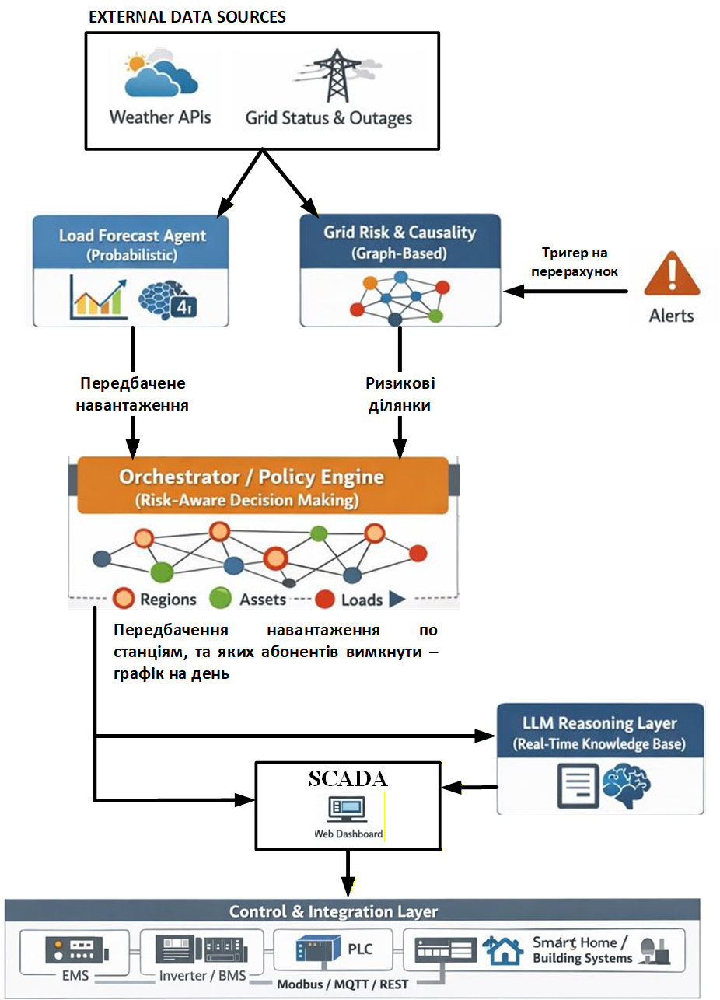

# AI Uncertainty-Aware Energy Orchestrator

!ПРИМІТКА: веб інтерфейс, та деякі складові працюють не дуже через брак часу, та проблеми з даними тощо. Все детально описано далі =)

Це інтелектуальна система підтримки прийняття рішень (DSS) для управління енергосистемою в умовах високої невизначеності (бойові дії, погодні аномалії, дефіцит генерації). Система поєднує графові нейронні мережі (GNN) для оцінки ризику вузлів та рекурентні мережі (GRU) для прогнозування навантаження.

## Джерела даних

1. **Дані про тривоги** (data/alerts dir) - cпаршено із сайту [link](https://alerts.in.ua/?showThreats&showWarnings)
2. **Дані про вимикання по регіонам** (2025_10_14_elektro_boiovi_dii_oblasti_osr.csv)- [link](https://energy-map.info/uk/datasets/3faa179e-321c-4a36-a0c5-c599932bd82f#description)
3. **Дані про попит і.т.д із штатів США** - [link](https://www.eia.gov/electricity/gridmonitor/dashboard/electric_overview/US48/US48)
4. **Погода** (апі має ліміти, які ми трішки обійшли, для демо піде, є платне збільшення лімітів) - [link](https://open-meteo.com/en/docs/historical-forecast-api)

## 🛠 Архітектура системи та файлова структура

Система розділена на три ключові агенти:

* Risk Agent (GNN): Оцінює ймовірність відмови вузлів (підстанцій та регіонів) на основі топології та зовнішніх загроз.
* Load Agent (GRU): Прогнозує дефіцит енергії на 6 годин вперед, використовуючи історичні патерни та погодні дані.
* Orchestrator: Агрегує прогнози для формування рекомендацій щодо стабілізації мережі.
* LLM Agent: обгрунтовує оператору або кінцевому користувачу причину.



## Навігація по файлах:

* GNN_AGENT.ipynb — Моделювання топології енергомережі України, тренування Graph Attention Network (GAT).
* LOAD_AGENT_PREPARE.ipynb — Пайплайн обробки даних: мапінг американських профілів споживання (EIA) на українські регіони, парсинг погоди, накладання тривог та пошкоджень й симуляція їх впливу.
* LOAD_AGENT_TRAIN.ipynb — Архітектура та тренування GRU моделі для прогнозу дефіциту.
* utils/ — Парсери повітряних тривог (alerts_parser.py) та скрипти очищення даних.
* serialized/ — Збережені ваги моделей (.pt) та скалери (.pkl).
* data/ — Сирі та оброблені датасети (погода, споживання, геодані).
* orchestrator.py - поєднує виходи двох агентів логічним чином.
* llm_agent.py - llm агент, з RAG системою
* main.py - демо вебсайт для тесту базового
* .config_example - приклад заповнення конфіг файлу з апі клчем.
* data/knowledge_base.txt - контекст для RAG-системи

## 🛰 Детальний опис компонентів

1. Risk Agent: Graph Neural Network (GNN)
Цей компонент системи фокусується на моделюванні топологічної вразливості енергосистеми. Замість того, щоб розглядати регіони як ізольовані об'єкти, Risk Agent аналізує їх як взаємопов'язаний граф, де аварія в одному вузлі може призвести до каскадних наслідків у сусідніх. Спочатку ми перетворили статичну карту України на складну математичну структуру - 27 канонічних регіонів України + 35 стратегічних підстанцій високої напруги (750 кВ, 440 кВ, 330 кВ та нижче). Ребрами побудовані на основі географічної близькості - регіони з'єднані за принципом K-найближчих сусідів (K=4), що імітує магістральні лінії електропередач. Кожна підстанція прив'язана до свого фізичного регіону, створюючи дворівневу структуру Використано реальні GPS-координати з додаванням нормалізованого випадкового зміщення (Gaussian noise) для візуалізації підстанцій без накладання.

Система інтегрує три критичні потоки даних:

* Дані про відключення споживачів та населених пунктів. Виконано контекстну імпутацію пропусків: якщо даних немає, модель підставляє медіану залежно від режиму (Calm — мирний час, Stress — під час тривог).
* Парсинг та агрегація даних про повітряні тривоги. 
*  Через Open-Meteo API (з використанням ротації проксі-серверів для обходу лімітів) додано 8 погодних метрик (вітер, пориви, опади, тиск), які корелюють з ризиком обриву ліній тощо.

Для прогнозування ризику ми розробили гібридну нейромережеву архітектуру:

* Graph Attention Layers (GATConv): Використовує Attention mechanism, щоб визначити, які сусідні вузли мають найбільший вплив на поточний ризик. Наприклад, якщо в Київській області тривога, GAT підвищує вагу зв'язку з Житомирською областю.
* Temporal Layer (GRU): Оскільки ризик не є миттєвим, ми використовуємо Gated Recurrent Units (GRU) для аналізу вікна у 7 останніх днів (T_WINDOW = 7). Це дозволяє моделі вловлювати "втому" системи та накопичувальний ефект пошкоджень.
* Output Layer: MLP-голова, що видає ймовірність необхідності диспетчерського втручання на наступну добу.

Результати виводяться на карту України, де колір вузла (від зеленого до червоного) та числовий скор показують ймовірність аварії.

2. Load Agent: Прогнозування навантаження та дефіциту

Основна проблема тут - відсутність публічних погодинних даних про споживання електроенергії в Україні. Ми вирішили це через метод перенесення знань (Domain Adaptation). Ми використали реальні погодинні профілі споживання 14 енерго-регіонів США (EIA). Кожен регіон США був математично зіставлений з відповідними областями України за категоріями (Big, Mid, Small) та масштабований через спеціальні коефіцієнти. Потім ми інтегрували дані про повітряні тривоги та розробили алгоритм деградації та відновлення. При влучанні (isDamaged) генерація в моделі миттєво падає на 20-45%, а потім поступово відновлюється протягом 24 годин. Це створило реалістичну навчальну базу, де попит і пропозиція реагують на зовнішні загрози.

На синтезованих даних поведінка фіч показує логічні тренди споживання та реакції на погоду.

Для забезпечення високої точності прогнозування ми змінили класичну рекурентну модель на просунуту архітектуру SystemEncoderDecoder:
* Encoder (Контекстний аналізатор): Використовує двонаправлену GRU для глибокого аналізу 3-денного вікна історичних даних (72 години). Він стискає ознаки всіх 27 регіонів одночасно, виявляючи приховані патерни між споживанням, погодою та попередніми ударами по інфраструктурі.*
* Decoder (Авторегресійний прогнозист): На відміну від статичних моделей, наш Декодер працює ітеративно. На кожному кроці прогнозу (від 1 до 6 години) він враховує не лише стан системи, а й екзогенні фактори майбутнього: очікувану температуру, швидкість вітру та симульовані події (активні тривоги чи нові пошкодження).
* Feedback Loop: Прогноз на годину $t$ стає входом для прогнозу на годину $t+1$. Це дозволяє моделі прогнозувати повний дефіцит енергії з урахуванням інерції системи, що критично важливо для планування реальних графіків відключень.

Модель здатна видавати погодинний прогноз дефіциту енергії для кожного регіону одночасно. Під час навчання ми досягли етапу Data Saturation - це означає, що архітектура витиснула максимум інформації з доступних нам даних.

3. Оркестратор

Оркестратор перетворює сухі прогнози двох попередніх агентів у конкретні управлінські рішення. Традиційні системи керування (EMS) працюють за лінійною логікою: якщо є дефіцит - вимикай. Наш Оркестратор діє складніше. Він поєднує амплітуду дефіциту (від Load Agent) та ймовірність аварії вузла (від Risk Agent), створюючи матрицю рішень:

* Червона зона (Високий ризик + Дефіцит): Режим CRITICAL_SHUTDOWN. Навіть за наявності технічної можливості передати енергію, GNN-аналіз вказує на критичну вразливість вузла. Додаткове навантаження може призвести до каскадного руйнування обладнання, тому Оркестратор ініціює превентивне розвантаження.
* Жовта зона (Низький ризик + Дефіцит): Режим EMERGENCY_CUTS або активне балансування. Система ідентифікує вузол як стабільний, що дозволяє безпечно приймати перетоки потужності з інших регіонів.
* Зелена зона: Режим STABLE_OPERATION або ECONOMY_MODE залежно від амплітуди профіциту.

Використовуючи графову структуру Risk Agent, Оркестратор не просто знаходить, "де є зайва енергія", а прораховує безпечний маршрут її доставки:

* Діагностика донорів: Система шукає регіони, де за прогнозом Load Agent є надлишок потужності, а Risk Agent підтверджує мінімальний ризик вузла ($Risk < 0.3$).
* Аналіз транзиту: Оркестратор перевіряє вузли-посередники на графі. Якщо шлях від донора до дефіцитного регіону проходить через "ризи
* Рекомендація: Формується чітка інструкція: "Перекинути X МВт з регіону А в регіон Б через лінію С, оскільки шлях є стабільним".

Використовуючи графову структуру мережі, Оркестратор не просто шукає "зайву" енергію, а прораховує безпечні маршрути її транзиту, враховуючи ризики проміжних вузлів.

4. LLM Agent
Цей компонент є інтелектуальним інтерфейсом системи, який перетворює складні математичні прогнози на зрозумілі технічні звіти для операторів енергосистеми. LLM Agent виконує роль "головного диспетчера", який поєднує числові дані з нормативними актами.

Агент побудований як спрямований циклічний граф станів. Це дозволяє йому працювати ітеративно: спочатку збирати дані з оркестратора, потім шукати відповідні правила в базі знань і лише після цього синтезувати фінальну відповідь. 

Оскільки знання LLM обмежені датою їхнього навчання, ми інтегрували векторну базу знань (FAISS). Агент "на льоту" зчитує файл knowledge_base.txt, що містить актуальні регламенти Укренерго, ліміти черг відключень та порогові значення погодних ризиків.

гент бачить систему цілісно. Він знає не тільки про дефіцит у Києві, а й про те, чи є вільна потужність у Львові, і чи дозволяє "Граф ризиків" (GNN) здійснити таку передачу.

## Порядок використання (відтворення всього пайплайну)

### Етап 0: Віртуальне середовище. Бібліотеки

* Windows:

```cmd
python -m venv venv
venv\Scripts\activate
```

* Linux/MacOS:

```cmd
python3 -m venv venv
source venv/bin/activate
```

```cmd
pip install --upgrade pip
pip install -r requirements.txt
```

### Етап 1: Збір та підготовка даних
#### `utils/alerts_parser.py`
**Призначення:** Парсить дані про повітряні тривоги з сайту alerts.in.ua  
**Що робить:**
- Автоматично завантажує CSV файли з тривогами за вказаний період
- Зберігає файли в `data/alerts/`
**Порядок виконання:** Запустіть першим для збору історичних даних про тривоги

#### `utils/prepare_alerts.py`
**Призначення:** Обробляє та об'єднує CSV файли з тривогами  
**Що робить:**
- Об'єднує всі CSV файли з папки `data/alerts/` в один файл
- Фільтрує тільки завершені тривоги (з датою закінчення)
- Сортує за датою та зберігає в `data/alerts_merged_sorted.csv`

**Порядок виконання:** Запустіть після `alerts_parser.py`

### Етап 2: Підготовка даних для GNN моделі

#### `GNN_AGENT.ipynb`
**Призначення:** Підготовка даних та навчання GNN моделі для прогнозування ризиків  
**Що робить:**
- Завантажує дані про відключення електроенергії (`data/2025_10_14_elektro_boiovi_dii_oblasti_osr.csv`)
- Завантажує дані про тривоги (`data/alerts_merged_sorted.csv`)
- Створює граф енергосистеми (регіони + підстанції)
- Завантажує погодні дані через Open-Meteo API
- Об'єднує всі дані в один датасет
- Навчає TemporalGAT (Temporal Graph Attention Network) модель
- Зберігає модель в `serialized/risk_gnn_model.pt` та скейлер в `serialized/risk_gnn_scaler.pkl`

**Порядок виконання:** Запустіть після підготовки даних про тривоги

### Етап 3: Підготовка даних для Load Agent

Можна або завантажити папку region_electricity_data із [link](https://drive.google.com/drive/folders/1S_RP5IcUzC7CRDGUO1BWBBzEo52lv8sO?usp=sharing) щоб код сам зчитав та об'єднав всі файли. Або запустити без цієї папки, використовуючи combined_region_electricity.csv файл, який вже об'єднав всі ці Excel файли та опрацював їх базово.

#### `LOAD_AGENT_PREPARE.ipynb`
**Призначення:** Підготовка даних для моделі прогнозування навантаження  
**Що робить:**
- Завантажує дані про споживання та генерацію електроенергії
- Мапить регіони США до регіонів України
- Завантажує погодні дані для регіонів США
- Розширює дані на регіони України з урахуванням масштабування
- Об'єднує з даними про тривоги (погодинно)
- Імітує вплив тривог та пошкоджень на генерацію та споживання
- Зберігає підготовлений датасет в `data/ready2use_region_electricity.csv`

**Порядок виконання:** Запустіть після `GNN_AGENT.ipynb` (або паралельно)


### Етап 4: Навчання Load Agent

#### `LOAD_AGENT_TRAIN.ipynb`
**Призначення:** Навчання моделі прогнозування навантаження на 24 години вперед  
**Що робить:**
- Завантажує підготовлений датасет з `data/ready2use_region_electricity.csv`
- Створює циклічні ознаки часу (sin/cos для години доби)
- Навчає GRU модель (LoadGRU) для прогнозування `energy_deficit_adj` на 6 години вперед
- Використовує контекстне вікно 3 дня
- Зберігає навчену модель та скейлер

**Порядок виконання:** Запустіть після `LOAD_AGENT_PREPARE.ipynb`

### Етап 5: Конфігурація бази знань та LLM-агента

Створіть файл .config із текстом OPENAI_API_KEY=sk-***,
де замість sk-*** вставте ваш API ключ (для швидкого теста обійдемося без додавання в енв)
Приклад заповнення в .config_example

### Етап 6: Оркестратор

#### `orchestrator.py`
**Призначення:** Координує роботу GNN та Load агентів, приймає рішення про розподіл ресурсів  
**Що робить:**
- Завантажує навчені моделі (GNN та Load)
- Отримує прогнози від обох агентів
- Аналізує ризики та прогнози навантаження
- Приймає рішення про оптимізацію енергосистеми
**Порядок виконання:** Не запускається напряму

##### Етап 6: Веб-інтерфейс та симуляція

**Призначення**: Графічний інтерфейс для моніторингу та стрес-тестування системи.
Візуалізує карту стратегічних ризиків України та графіки дефіциту по регіонах. Дозволяє оператору вручну імітувати тривоги та влучання для Декодера (майбутнього), спостерігаючи за миттєвою зміною прогнозу. Виводить динамічні рекомендації щодо балансування та AI-обґрунтування від LangGraph-агента. Надає таблицю загальносистемного моніторингу всіх вузлів у реальному часі.

**Порядок виконання:** Запустіть командою streamlit run main.py із директорії, де знаходить файл main.py.